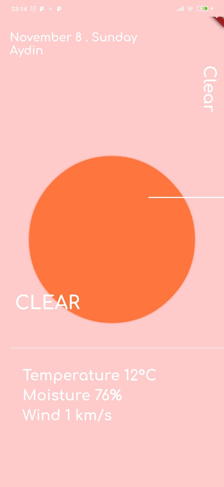
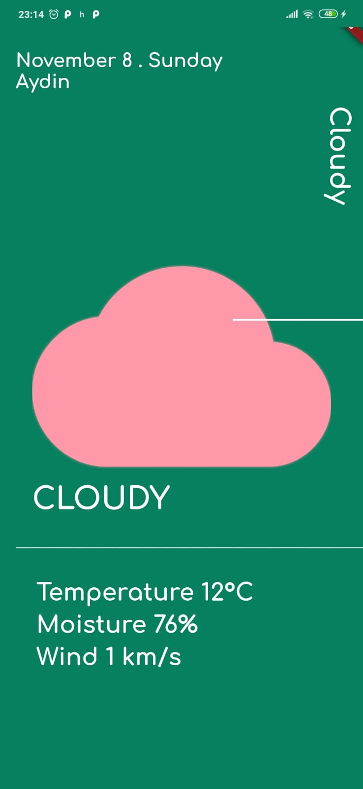
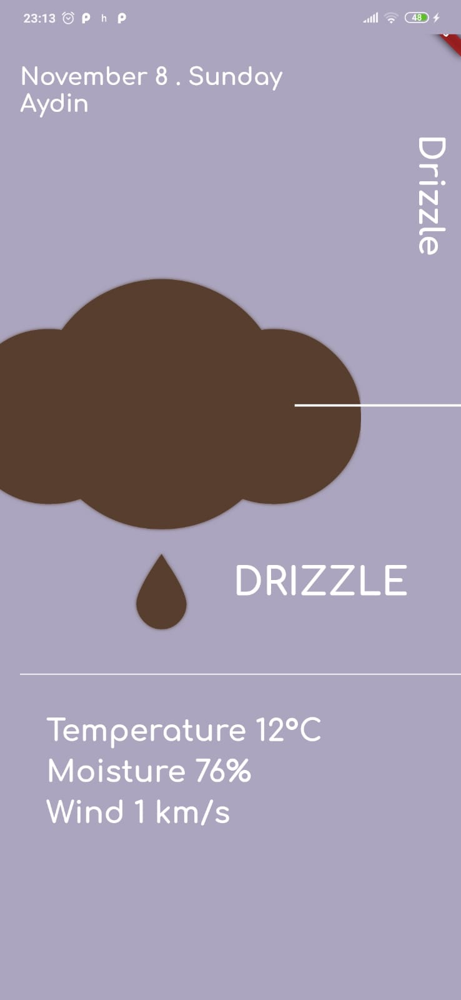
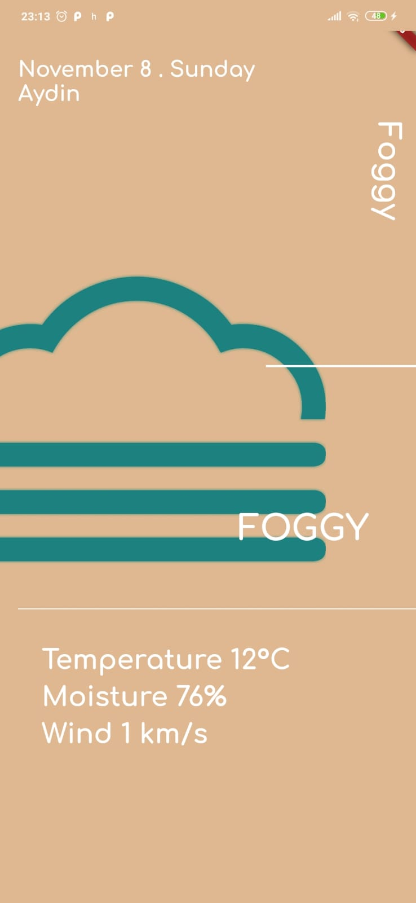
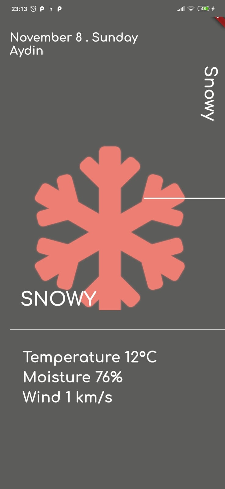
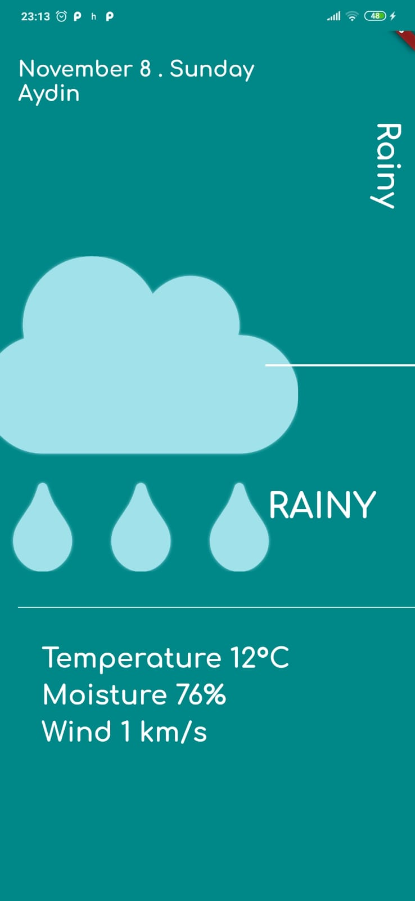
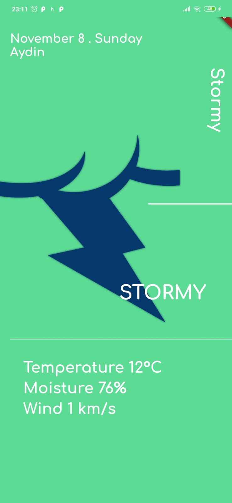
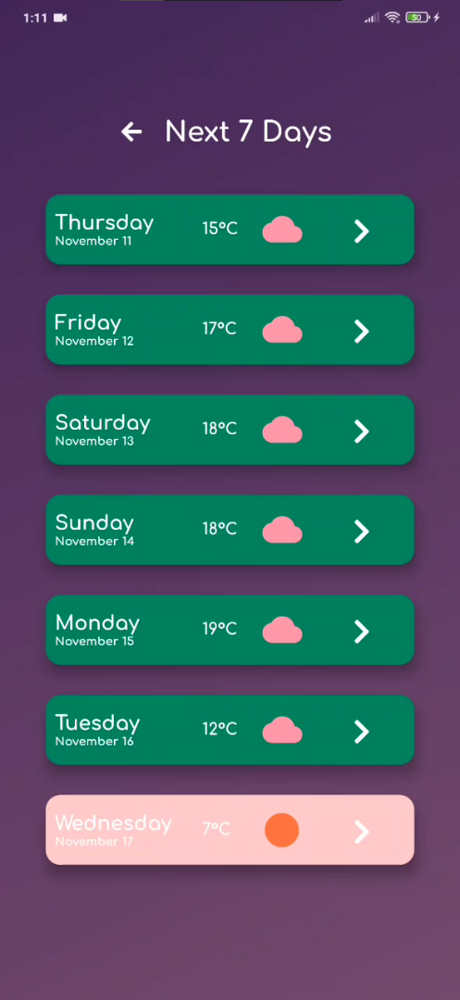
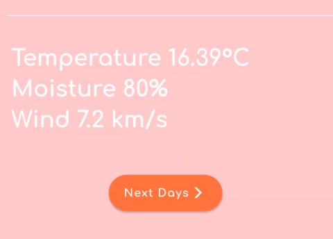

# weather_app

#### Version 1

This is a weather application which gets your city by your location and shows weather of 7 days. The app gets weather information from openweather API.
The User Interface and the design of page changes according to the weather condition user's city.

----------------------------------------------------
Here is the screenshots of weather condition pages:

  
   
  
  
   
  
  

------------------------------------------------------------------------------------------------------------------------------------------------

#### Update to version 2:

!! Added Next Days Button at bottom of the pages to navigate directly to a page that shows weather information of next 7 days briefly.
!! The new 7 days information page's color scheme changes according to the weather condition.
!! Added animation when sliding pages.

   
  

